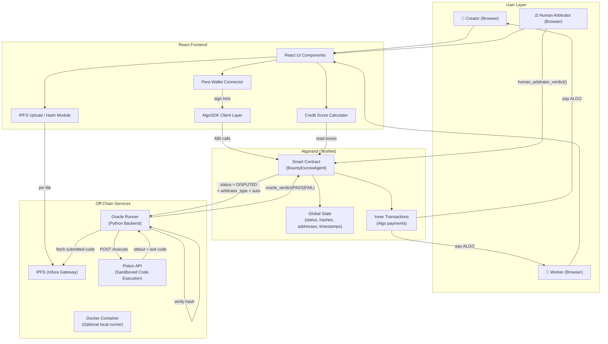
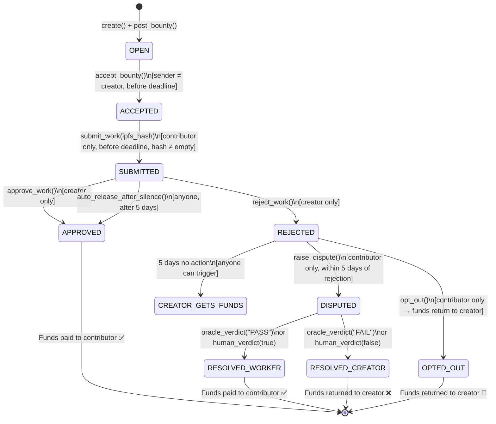
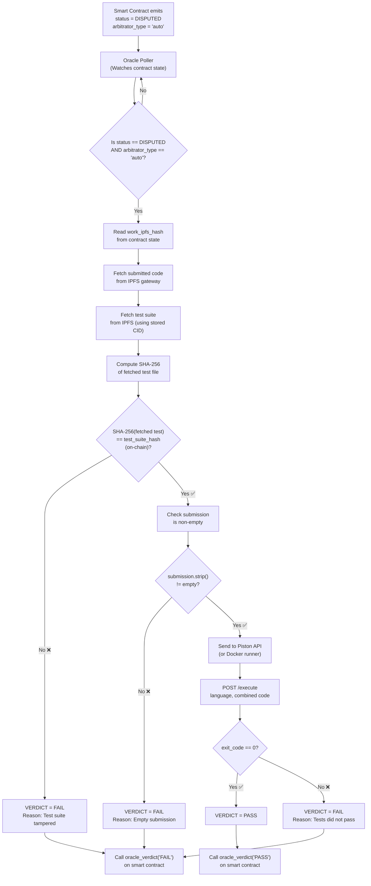
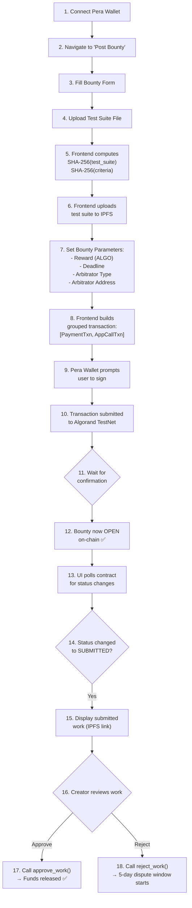
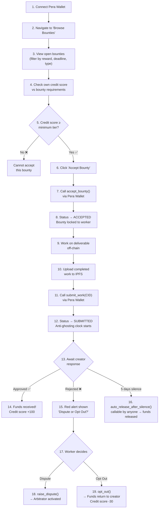
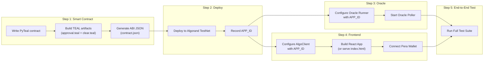

# Bounty Escrow Agent — Logical Architecture & Prototype Blueprint

**Team Marcos.dev | BIT Sindri | Hackatron 3.0**

> [!NOTE]
> This document is a **code-free**, purely logical reference. It describes *how every component communicates*, the *order of operations* required to build the prototype, and the *algorithms* governing each subsystem.

---

## Table of Contents

1. [Phase 1 — System Architecture & Data Flow](#phase-1--system-architecture--data-flow)
2. [Phase 2 — Smart Contract Logic (Algorand / PyTeal)](#phase-2--smart-contract-logic-algorand--pyteal)
3. [Phase 3 — Backend / Oracle Workflow](#phase-3--backend--oracle-workflow)
4. [Phase 4 — Frontend Logic (React)](#phase-4--frontend-logic-react)
5. [Phase 5 — Deployment & Testing](#phase-5--deployment--testing)

---

## Phase 1 — System Architecture & Data Flow

### 1.1  High-Level Topology



### 1.2  Data Flow — End-to-End (Happy Path)

| Step | Actor | Action | Target | Data Exchanged |
|------|-------|--------|--------|----------------|
| 1 | Creator | Opens frontend, connects Pera Wallet | React UI → Pera | Wallet address returned |
| 2 | Creator | Fills bounty form (description, reward, deadline, test suite) | React UI | Form fields captured in-memory |
| 3 | React UI | Computes SHA-256 of test suite file and criteria document | Local browser | `criteria_hash`, `test_suite_hash` |
| 4 | React UI | Uploads test suite to IPFS | IPFS Gateway | Returns IPFS CID of test suite |
| 5 | React UI | Constructs `post_bounty()` ABI call + payment transaction | AlgoSDK | Grouped transaction: [Payment, AppCall] |
| 6 | Pera Wallet | User signs the grouped transaction | Algorand Network | Transaction submitted to TestNet |
| 7 | Smart Contract | Validates payment, stores all state, sets status = OPEN | Global State | Creator address, reward, deadline, hashes stored on-chain |
| 8 | Worker | Browses bounties, selects one, calls `accept_bounty()` | Smart Contract | Status → ACCEPTED, contributor address stored |
| 9 | Worker | Completes work, uploads to IPFS | IPFS Gateway | Returns IPFS CID of submission |
| 10 | Worker | Calls `submit_work(ipfs_cid)` | Smart Contract | Status → SUBMITTED, `submitted_at` timestamp recorded |
| 11 | Creator | Reviews work, calls `approve_work()` | Smart Contract | Status → APPROVED, inner txn pays contributor |
| 12 | Smart Contract | Executes inner payment transaction | Algorand Network | ALGO transferred from contract to worker |

### 1.3  Component Communication Map

```
┌──────────────┐     HTTPS/WSS      ┌─────────────────┐     ABI Calls      ┌──────────────┐
│  React App   │ ──────────────────→ │   AlgoNode RPC  │ ──────────────────→ │  Algorand    │
│  (Browser)   │ ←────────────────── │   (TestNet)     │ ←────────────────── │  Smart       │
└──────┬───────┘                     └─────────────────┘                     │  Contract    │
       │                                                                     └──────┬───────┘
       │  WalletConnect                                                             │
       ▼                                                                             │ Inner Txn
┌──────────────┐                                                              ┌──────▼───────┐
│  Pera Wallet │                                                              │  Fund        │
│  (Mobile)    │                                                              │  Transfer    │
└──────────────┘                                                              └──────────────┘
       │
       │  HTTPS (Infura)
       ▼
┌──────────────┐     HTTPS (REST)    ┌─────────────────┐
│  IPFS Node   │ ←────────────────── │  Oracle Runner  │
│  (Infura)    │                     │  (Python)       │
└──────────────┘                     └────────┬────────┘
                                              │ POST /execute
                                              ▼
                                     ┌─────────────────┐
                                     │  Piston API     │
                                     │  (Sandbox)      │
                                     └─────────────────┘
```

### 1.4  Security Boundaries

| Boundary | Mechanism | Purpose |
|----------|-----------|---------|
| User ↔ Contract | Pera Wallet signature | Only authorized accounts can call restricted methods |
| Contract ↔ Funds | Inner Transactions | Funds locked in contract address; released only by contract logic |
| Test Suite Integrity | SHA-256 hash frozen on-chain | Prevents post-creation tampering of test cases |
| Work Submission | IPFS CID + non-empty validation | Ensures real work is submitted before payout |
| Oracle ↔ Contract | Designated oracle address (production) | Prevents unauthorized verdict submission |
| Arbitrator ↔ Contract | `arbitrator_addr` stored on-chain | Only the pre-designated arbitrator can rule on disputes |

---

## Phase 2 — Smart Contract Logic (Algorand / PyTeal)

### 2.1  State Machine — Complete Transition Map



### 2.2  Global State Schema

| Key | Type | Set When | Purpose |
|-----|------|----------|---------|
| `creator` | bytes (address) | `post_bounty()` | Account that posted the bounty |
| `contributor` | bytes (address) | `accept_bounty()` | Account that accepted the bounty |
| `reward_amount` | uint64 | `post_bounty()` | ALGO reward locked in escrow (microAlgos) |
| `deadline` | uint64 | `post_bounty()` | UNIX timestamp after which no new submissions accepted |
| `criteria_hash` | bytes | `post_bounty()` | SHA-256 hex of the requirements/brief document |
| `test_suite_hash` | bytes | `post_bounty()` | SHA-256 hex of the test case file (frozen, immutable) |
| `work_ipfs_hash` | bytes | `submit_work()` | IPFS CID of the contributor's submitted work |
| `arbitrator_type` | bytes | `post_bounty()` | `"auto"` for code / `"human"` for subjective work |
| `arbitrator_addr` | bytes (address) | `post_bounty()` | Designated human arbitrator's Algorand address |
| `status` | uint64 | All transitions | Current state (0–8) |
| `submitted_at` | uint64 | `submit_work()` | Timestamp of submission (used for anti-ghosting timer) |
| `rejected_at` | uint64 | `reject_work()` | Timestamp of rejection (used for dispute window) |

### 2.3  Method-by-Method Logic

#### `create()` — Application Creation
```
PRECONDITIONS: None (first call)
ALGORITHM:
  1. Initialize status = OPEN (0)
  2. All other state defaults to empty/zero
POSTCONDITION: Contract exists on-chain with empty state
```

#### `post_bounty(criteria_hash, test_suite_hash, deadline, arbitrator_type, arbitrator_addr, payment)` — Fund Escrow
```
PRECONDITIONS:
  ✓ status == OPEN
  ✓ creator field is empty (not already posted)
  ✓ payment.receiver == contract address
  ✓ payment.amount > 0
  ✓ deadline > current block timestamp

ALGORITHM:
  1. Store sender as `creator`
  2. Store payment amount as `reward_amount`
  3. Store deadline, criteria_hash, test_suite_hash, arbitrator_type, arbitrator_addr
  4. Status remains OPEN (waiting for a contributor)
  
FUND FLOW:
  Creator's wallet  ──[payment txn]──→  Contract address (escrow)

POSTCONDITION: Funds locked in contract. Bounty visible to workers.
```

#### `accept_bounty()` — Worker Claims a Bounty
```
PRECONDITIONS:
  ✓ status == OPEN
  ✓ sender ≠ creator (no self-dealing)
  ✓ current timestamp < deadline

ALGORITHM:
  1. Store sender as `contributor`
  2. Status → ACCEPTED (1)

POSTCONDITION: Bounty locked to this specific contributor. No other worker can accept.
```

#### `submit_work(ipfs_hash)` — Worker Delivers
```
PRECONDITIONS:
  ✓ status == ACCEPTED
  ✓ sender == contributor
  ✓ current timestamp < deadline
  ✓ length(ipfs_hash) > 0   ← PROOF VERIFICATION: empty submissions blocked

ALGORITHM:
  1. Store ipfs_hash as `work_ipfs_hash`
  2. Record `submitted_at` = current timestamp  ← starts anti-ghosting clock
  3. Status → SUBMITTED (2)

POSTCONDITION: Work on-chain. 5-day anti-ghosting timer begins.
```

#### `approve_work()` — Creator Accepts Delivery
```
PRECONDITIONS:
  ✓ status == SUBMITTED
  ✓ sender == creator

ALGORITHM:
  1. Status → APPROVED (3)
  2. Execute inner payment: contract → contributor for reward_amount

FUND FLOW:
  Contract address  ──[inner txn]──→  Contributor's wallet

POSTCONDITION: Contributor is paid. Bounty lifecycle complete.
```

#### `reject_work()` — Creator Disputes Quality
```
PRECONDITIONS:
  ✓ status == SUBMITTED
  ✓ sender == creator

ALGORITHM:
  1. Status → REJECTED (4)
  2. Record `rejected_at` = current timestamp  ← starts dispute window clock

POSTCONDITION: Contributor has 5 days to dispute or opt out. Funds stay locked.
```

#### `raise_dispute()` — Contributor Challenges Rejection
```
PRECONDITIONS:
  ✓ status == REJECTED
  ✓ sender == contributor
  ✓ current timestamp < (rejected_at + 5 days)  ← within dispute window

ALGORITHM:
  1. Status → DISPUTED (5)

POSTCONDITION: Awaiting arbitrator verdict. Funds remain locked.
```

#### `opt_out()` — Contributor Walks Away
```
PRECONDITIONS:
  ✓ status == REJECTED
  ✓ sender == contributor

ALGORITHM:
  1. Status → OPTED_OUT (8)
  2. Execute inner payment: contract → creator for reward_amount

FUND FLOW:
  Contract address  ──[inner txn]──→  Creator's wallet (refund)

POSTCONDITION: Creator refunded. Contributor's credit score penalized off-chain.
```

#### `auto_release_after_silence()` — Anti-Ghosting
```
PRECONDITIONS:
  ✓ status == SUBMITTED
  ✓ current timestamp > (submitted_at + 5 days)  ← creator has been silent

ALGORITHM:
  1. Status → APPROVED (3)
  2. Execute inner payment: contract → contributor for reward_amount

CALL PERMISSIONS: **Anyone** can call this (permissionless)

RATIONALE: 
  - Prevents creator from ghosting after receiving work
  - 5-day grace period gives creator reasonable review time
  - Public callability means contributor doesn't need to monitor

FUND FLOW:
  Contract address  ──[inner txn]──→  Contributor's wallet (auto-released)
```

#### `oracle_verdict(result)` — Automated Arbitration
```
PRECONDITIONS:
  ✓ status == DISPUTED
  ✓ arbitrator_type == "auto"
  ✓ (Production: sender == designated oracle address)

ALGORITHM:
  IF result == "PASS":
    1. Status → RESOLVED_WORKER (6)
    2. Inner payment: contract → contributor
  ELSE (result == "FAIL"):
    1. Status → RESOLVED_CREATOR (7)
    2. Inner payment: contract → creator

POSTCONDITION: Dispute resolved. Funds distributed based on automated test results.
```

#### `human_arbitrator_verdict(favor_contributor)` — Human Arbitration
```
PRECONDITIONS:
  ✓ status == DISPUTED
  ✓ sender == arbitrator_addr (designated arbitrator only)
  ✓ arbitrator_type == "human"

ALGORITHM:
  IF favor_contributor == true:
    1. Status → RESOLVED_WORKER (6)
    2. Inner payment: contract → contributor
  ELSE:
    1. Status → RESOLVED_CREATOR (7)
    2. Inner payment: contract → creator

POSTCONDITION: Subjective dispute resolved by trusted third party.
```

### 2.4  Inner Transaction Fee Model

```
EVERY method that triggers a payment MUST:
  1. Set the outer transaction fee = 2000 microAlgos (covers inner txn)
  2. Set the inner transaction fee = 0 (fee pooling from outer txn)

Methods that trigger payments:
  ✓ approve_work()
  ✓ opt_out()
  ✓ auto_release_after_silence()
  ✓ oracle_verdict()
  ✓ human_arbitrator_verdict()
```

### 2.5  Timer Logic Summary

```
┌─────────────────────────────────────────────────────────────────────┐
│                      TIME-BASED TRIGGERS                           │
├────────────────────┬───────────────┬────────────────────────────────┤
│ Timer              │ Duration      │ Effect                         │
├────────────────────┼───────────────┼────────────────────────────────┤
│ Anti-Ghosting      │ 5 days from   │ Anyone can auto-release funds  │
│                    │ submitted_at  │ to contributor                 │
├────────────────────┼───────────────┼────────────────────────────────┤
│ Dispute Window     │ 5 days from   │ Contributor must dispute or    │
│                    │ rejected_at   │ opt out; else creator gets     │
│                    │               │ funds back automatically       │
├────────────────────┼───────────────┼────────────────────────────────┤
│ Bounty Deadline    │ Custom (set   │ No new accept/submit after     │
│                    │ by creator)   │ deadline passes                │
└────────────────────┴───────────────┴────────────────────────────────┘
```

---

## Phase 3 — Backend / Oracle Workflow

### 3.1  Oracle Architecture



### 3.2  Piston API Integration Pipeline

```
STEP 1 — LANGUAGE DETECTION
  Input:  file extension of submitted code
  Map:    .py → python | .js → javascript | .ts → typescript
          .rs → rust    | .go → go         | .java → java
          .cpp → c++    | .c → c
  Default: python

STEP 2 — CODE COMBINATION
  Algorithm:
    combined_source = submitted_code + "\n\n" + test_code
  Rationale: 
    Piston runs a single file. Test code imports/uses submitted code's 
    functions, so concatenation makes them available in same scope.

STEP 3 — EXECUTION REQUEST
  Endpoint: POST https://emkc.org/api/v2/piston/execute
  Payload:
    {
      language:        <detected language>,
      version:         "*" (latest stable),
      files:           [{ name: "main.<ext>", content: <combined_source> }],
      stdin:           "",
      compile_timeout: 10000ms,
      run_timeout:     5000ms
    }

STEP 4 — RESULT INTERPRETATION
  Response structure:
    { run: { code: <exit_code>, stdout: <output>, stderr: <errors> } }

  Verdict mapping:
    exit_code == 0  →  PASS  (all tests passed)
    exit_code != 0  →  FAIL  (tests failed or runtime error)
```

### 3.3  Docker Runner (Alternative / Production Path)

```
PURPOSE: 
  For projects requiring multi-file execution, system dependencies,
  or custom environments that Piston cannot handle.

PIPELINE:
  1. Oracle receives IPFS CID of submission
  2. Download submission archive from IPFS
  3. Spin up Docker container with language-specific base image
  4. Mount submission files + frozen test suite into container
  5. Execute test suite inside container with timeout
  6. Capture exit code and stdout/stderr
  7. Destroy container
  8. Submit verdict to smart contract

SECURITY CONSTRAINTS:
  - Container has NO network access (--network=none)
  - Memory limit: 256MB (--memory=256m)
  - CPU limit: 1 core (--cpus=1)
  - Execution timeout: 30 seconds
  - Read-only filesystem except /tmp
  - No privileged mode
```

### 3.4  IPFS Storage Workflow

```
┌──────────────────────────────────────────────────────────────────┐
│                     IPFS DATA FLOW                               │
├────────────────────────────┬─────────────────────────────────────┤
│ Upload (Frontend → IPFS)   │ Download (Oracle ← IPFS)           │
├────────────────────────────┼─────────────────────────────────────┤
│ 1. User selects file       │ 1. Oracle reads work_ipfs_hash     │
│ 2. Frontend reads as bytes │    from contract global state      │
│ 3. Compute SHA-256 locally │ 2. Fetch via IPFS HTTP Gateway:    │
│ 4. POST to Infura IPFS API │    GET /ipfs/{CID}                 │
│    (pinning service)       │ 3. Save to local temp file         │
│ 5. Receive CID (content    │ 4. Verify file is non-empty        │
│    identifier) back        │ 5. Proceed with test execution     │
│ 6. Store CID on-chain via  │                                    │
│    submit_work() call      │                                    │
└────────────────────────────┴─────────────────────────────────────┘

HASH VERIFICATION FLOW:
  At bounty creation:
    test_file_bytes  →  SHA-256  →  stored as test_suite_hash on-chain
  
  At dispute resolution:
    fetched_test_file  →  SHA-256  →  compare to on-chain test_suite_hash
    MATCH    → proceed with test execution
    MISMATCH → immediate FAIL verdict (tampering detected)
```

### 3.5  Oracle Polling Strategy

```
ALGORITHM: Poll-Based State Watcher

LOOP (every 10 seconds):
  1. Query contract global state via AlgoNode REST API
  2. Read current `status` value
  3. IF status == 5 (DISPUTED) AND arbitrator_type == "auto":
       a. Extract work_ipfs_hash, test_suite_hash from state
       b. Run full evaluation pipeline (§3.1)
       c. Submit verdict transaction to contract
       d. Wait for transaction confirmation
  4. ELSE: sleep(10), continue polling

PRODUCTION IMPROVEMENT:
  Replace polling with Algorand Indexer subscription or 
  webhook-based event listening for status changes.
```

---

## Phase 4 — Frontend Logic (React)

### 4.1  Application Structure

```
frontend/
├── index.html              ← Standalone prototype (full UI, no build step)
└── src/
    ├── algoClient.js        ← AlgoSDK wrapper: ABI calls, transaction building
    ├── ipfsUtils.js         ← IPFS upload, SHA-256 hashing utilities
    └── creditScore.js       ← CIBIL-inspired on-chain credit score calculator
```

### 4.2  User Journey — Creator (Bounty Poster)



### 4.3  User Journey — Worker (Bounty Contributor)



### 4.4  Pera Wallet Integration Flow

```
INITIALIZATION:
  1. Import PeraWalletConnect from @perawallet/connect
  2. Create instance with chainId = 416002 (TestNet)
  3. On page load: attempt reconnect() for returning users

CONNECT FLOW:
  1. User clicks "Connect Wallet"
  2. Call peraWallet.connect()
  3. Pera mobile app shows QR code / deep link
  4. User approves connection
  5. Frontend receives array of connected addresses
  6. Store address[0] as active account
  7. UI updates: show truncated address, enable bounty features

TRANSACTION SIGNING:
  1. Frontend builds unsigned transaction(s) using AlgoSDK
  2. For grouped transactions: assignGroupID([txn1, txn2, ...])
  3. Call peraWallet.signTransaction([txnGroups])
  4. Pera app prompts user to review and sign
  5. Frontend receives signed transaction bytes
  6. Submit signed bytes to Algorand via algodClient.sendRawTransaction()
  7. Wait for confirmation: waitForConfirmation(txId, 4 rounds)

DISCONNECT:
  1. User clicks "Disconnect"
  2. Call peraWallet.disconnect()
  3. Clear stored account
  4. UI resets to unauthenticated state
```

### 4.5  Real-Time State Polling

```
ALGORITHM: Frontend Status Poller

ON_MOUNT (when user views a bounty page):
  1. Read APP_ID from configuration
  2. Call algodClient.getApplicationByID(APP_ID)
  3. Decode global state values from response
  4. Map status integer → human-readable label
  5. Render current state in UI

  STATUS_MAP:
    0 → "Open"       (green badge)
    1 → "Accepted"   (blue badge)
    2 → "Submitted"  (yellow badge, show countdown)
    3 → "Approved"   (green badge, confetti animation)
    4 → "Rejected"   (red badge, show dispute/opt-out buttons)
    5 → "Disputed"   (orange badge, show "Awaiting Arbitrator")
    6 → "Worker Wins" (green badge)
    7 → "Creator Wins" (red badge)
    8 → "Opted Out"  (gray badge)

POLLING INTERVAL: 5 seconds (setInterval)
CLEANUP: Clear interval on component unmount
```

### 4.6  Credit Score System — Algorithm

```
INPUT VARIABLES (per user):
  completions    = number of successfully completed bounties
  disputes_won   = number of disputes won by this user
  disputes_lost  = number of disputes lost by this user
  opted_out      = number of times user opted out of rejected bounties

FORMULA:
  raw_score = (completions × 100) + (disputes_won × 50) - (disputes_lost × 80) - (opted_out × 30)

  max_expected = 1000  (normalization constant)

  normalized = 300 + (raw_score / max_expected) × 600

  final_score = CLAMP(normalized, 300, 900)

TIER MAPPING:
  ┌──────────┬─────────────┬───────────────────────────┐
  │ Tier     │ Score Range │ Access Level              │
  ├──────────┼─────────────┼───────────────────────────┤
  │ Bronze   │ 300 – 499   │ Basic bounties only       │
  │ Silver   │ 500 – 649   │ Standard bounties         │
  │ Gold     │ 650 – 799   │ All bounties + priority   │
  │ Platinum │ 800 – 900   │ Premium bounties + mentor │
  └──────────┴─────────────┴───────────────────────────┘

STORAGE STRATEGY:
  - Prototype: Store in-memory / localStorage
  - Production: Store in Algorand Box Storage
    Key   = user's Algorand address (32 bytes)
    Value = packed uint64 (completions|disputes_won|disputes_lost|opted_out)
```

### 4.7  UI Component Architecture

```
App (Root)
├── Header
│   ├── Logo + Title
│   ├── Navigation Tabs: [Browse, Post Bounty, My Bounties, Profile]
│   └── Wallet Button (Connect / Disconnect / Address Display)
│
├── Browse Page
│   ├── Filter Bar (reward range, deadline, arbitrator type)
│   ├── Bounty Card Grid
│   │   └── Bounty Card (title, reward, deadline, status badge, credit tier)
│   └── Empty State (no bounties available)
│
├── Post Bounty Page
│   ├── Bounty Form
│   │   ├── Title / Description fields
│   │   ├── Reward Amount input (ALGO)
│   │   ├── Deadline Picker
│   │   ├── Test Suite File Upload
│   │   ├── Criteria Document Upload
│   │   ├── Arbitrator Type Selector (Auto / Human)
│   │   └── Arbitrator Address input (if Human)
│   └── Submit Button (triggers grouped txn)
│
├── My Bounties Page
│   ├── Tab: "As Creator" / "As Contributor"
│   ├── Bounty Detail Panel
│   │   ├── Status Badge + Progress Timeline
│   │   ├── Submitted Work Link (IPFS)
│   │   ├── Action Buttons (Approve / Reject / Dispute / Opt Out)
│   │   └── Anti-Ghosting Countdown (if SUBMITTED)
│   └── Dispute Resolution Panel (if DISPUTED)
│
├── Profile Page
│   ├── Credit Score Gauge (CIBIL-style dial)
│   ├── Score Breakdown (completions, disputes won/lost, opt-outs)
│   ├── Tier Badge + Tier Benefits Description
│   └── Transaction History
│
└── Footer
    └── Network Status + TestNet Indicator + Links
```

---

## Phase 5 — Deployment & Testing

### 5.1  Build Order (Dependency Graph)



### 5.2  Deployment Steps — Smart Contract to TestNet

```
PREREQUISITES:
  ✓ Python 3.10+ with beaker-pyteal and algokit installed
  ✓ AlgoKit CLI installed and configured
  ✓ Algorand TestNet account with test ALGO (from faucet)

STEP 1 — BUILD ARTIFACTS
  Action:  Run bounty_escrow.py to generate TEAL + ABI
  Input:   contracts/bounty_escrow.py
  Output:  contracts/artifacts/
           ├── approval.teal        (approval program)
           ├── clear.teal           (clear state program)
           ├── contract.json        (ABI specification)
           └── application.json     (app spec)

STEP 2 — FUND DEPLOYER ACCOUNT
  Action:  Use Algorand TestNet Dispenser
  Target:  https://bank.testnet.algorand.network/
  Amount:  Minimum 10 ALGO for deployment + testing

STEP 3 — DEPLOY CONTRACT
  Action:  Use AlgoKit or custom deploy script
  Process:
    a. Connect to AlgoNode TestNet API:
       Server: https://testnet-api.algonode.cloud
       Port:   443
       Token:  (empty for public node)
    b. Create ApplicationCreateTxn with:
       - approval_program = compiled approval.teal
       - clear_program = compiled clear.teal
       - global schema: 12 uint64 + 7 bytes
       - local schema: 0 (no local state in prototype)
    c. Sign with deployer's private key
    d. Submit transaction
    e. Wait for confirmation
    f. Record the returned APP_ID

STEP 4 — FUND THE CONTRACT ADDRESS
  Action:  Send minimum balance (0.1 ALGO) to the contract
  Why:     Algorand requires all accounts to hold minimum balance
  How:     Send payment transaction to the contract's generated address

STEP 5 — VERIFY DEPLOYMENT
  Action:  Query contract state via AlgoNode API
  Check:
    ✓ Application exists with correct APP_ID
    ✓ Global state has all expected keys
    ✓ Status == 0 (OPEN)
    ✓ Creator field is empty (awaiting post_bounty call)
```

### 5.3  End-to-End Test Plan — Prototype Smoke Test

```
TEST SCENARIO 1: HAPPY PATH
──────────────────────────────
  Actor A = Creator (Pera Wallet Account 1)
  Actor B = Worker  (Pera Wallet Account 2)

  1. [Creator] post_bounty(criteria_hash, test_hash, deadline, "auto", oracle_addr, 1 ALGO)
     VERIFY: status == 0, reward_amount == 1_000_000, creator == A.address

  2. [Worker] accept_bounty()
     VERIFY: status == 1, contributor == B.address

  3. [Worker] submit_work("QmExampleIPFSHash123")
     VERIFY: status == 2, work_ipfs_hash == "QmExampleIPFSHash123"
             submitted_at is set to recent timestamp

  4. [Creator] approve_work()
     VERIFY: status == 3
             B.balance increased by ~1 ALGO
             Contract balance decreased by ~1 ALGO


TEST SCENARIO 2: REJECTION → DISPUTE → AUTOMATED VERDICT
──────────────────────────────────────────────────────────
  1. Complete steps 1–3 from Scenario 1

  2. [Creator] reject_work()
     VERIFY: status == 4, rejected_at is set

  3. [Worker] raise_dispute()
     VERIFY: status == 5

  4. [Oracle] oracle_verdict("PASS")
     VERIFY: status == 6 (RESOLVED_WORKER)
             Worker receives funds


TEST SCENARIO 3: REJECTION → OPT OUT
──────────────────────────────────────
  1. Complete steps 1–3 from Scenario 1

  2. [Creator] reject_work()
     VERIFY: status == 4

  3. [Worker] opt_out()
     VERIFY: status == 8 (OPTED_OUT)
             Creator receives refund


TEST SCENARIO 4: ANTI-GHOSTING
──────────────────────────────
  1. Complete steps 1–3 from Scenario 1

  2. Wait 5+ days (or manipulate timestamp in sandbox)

  3. [Anyone] auto_release_after_silence()
     VERIFY: status == 3 (APPROVED)
             Worker receives funds despite creator silence


TEST SCENARIO 5: HUMAN ARBITRATION
───────────────────────────────────
  Actor C = Human Arbitrator (Pera Wallet Account 3)

  1. [Creator] post_bounty(..., "human", C.address, 1 ALGO)
  2. [Worker] accept_bounty() → submit_work()
  3. [Creator] reject_work()
  4. [Worker] raise_dispute()
     VERIFY: status == 5

  5. [Arbitrator C] human_arbitrator_verdict(True)
     VERIFY: status == 6 (Worker wins)

  6. Repeat with human_arbitrator_verdict(False)
     VERIFY: status == 7 (Creator wins)


TEST SCENARIO 6: EDGE CASES
────────────────────────────
  ✗ Creator tries to accept own bounty → REJECTED (sender ≠ creator check)
  ✗ Worker submits empty IPFS hash → REJECTED (length > 0 check)
  ✗ Random account calls approve_work() → REJECTED (creator-only check)
  ✗ Worker submits after deadline → REJECTED (timestamp check)
  ✗ Worker disputes after 5-day window → REJECTED (dispute window check)
  ✗ Non-arbitrator calls human_verdict() → REJECTED (address check)
  ✗ Oracle verdict when arbitrator_type == "human" → REJECTED (type check)
```

### 5.4  Verification Checklist

```
CONTRACT VERIFICATION
  □ All 9 status states are reachable
  □ Every fund release has a corresponding inner transaction
  □ No state allows funds to be stuck permanently
  □ Timer-based methods correctly compute 5-day windows
  □ ABI JSON matches method signatures

ORACLE VERIFICATION
  □ Piston API returns correct results for known pass/fail inputs
  □ SHA-256 hash verification catches tampered test suites
  □ Empty submissions are caught before execution
  □ Oracle correctly submits verdict transaction

FRONTEND VERIFICATION
  □ Pera Wallet connects and disconnects cleanly
  □ Transaction signing prompts appear correctly
  □ Status badges update after transactions confirm
  □ IPFS upload returns valid CIDs
  □ Credit score calculates correctly from raw inputs
  □ Anti-ghosting countdown displays accurately
  □ Dispute/Opt-out buttons appear only when status == REJECTED

INTEGRATION VERIFICATION
  □ Frontend → Contract: post_bounty sends grouped txn correctly
  □ Contract → Frontend: status polling reflects on-chain state
  □ Frontend → IPFS: file upload + hash computation works
  □ Oracle → Contract: verdict submission changes state correctly
  □ Credit scores update after each lifecycle event
```

---

> [!IMPORTANT]
> **Build order matters.** Always deploy and verify the smart contract first (Phase 2 → 5.2), then configure the oracle (Phase 3), then connect the frontend (Phase 4). Each layer depends on the APP_ID from the previous step.

> [!TIP]
> For rapid prototype iteration, use **AlgoKit LocalNet** (local sandbox) instead of TestNet. This gives instant transaction confirmation and lets you manipulate timestamps for testing anti-ghosting and dispute windows without waiting 5 real days.
